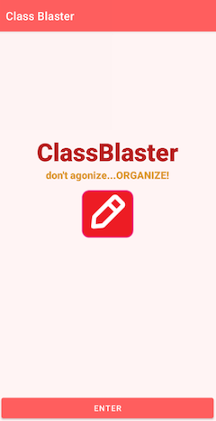

. 
# classblaster
**Classblaster** is a simple SQLite-based app that allows the user to keep track
of their terms, courses, and assessments. The user can create new TERMS, add
COURSES to those TERMS, and add ASSESSMENTS to those COURSES. In addition, notes
can be added for each COURSE and those notes can be shared with other students
via text or email with the push of a button.

## Build Status
-this app was written as part of a WGU course on mobile application development
-finished 04/21

## Code Style
This application was written in Java using Android Studio and the MVC design
pattern. The data is stored on the device using SQLite and the Room Framework.
Classes are divided into four categories: Database, DAO, Entity, and UI. 

## User Interface

The user interface is a heirarchical "tree" with TERMS at the top. 
There is a simple login page to start off the initial screen, which 
is a list of TERMS that are active.

   

The UI allows the user to drill down into the COURSES that are in 
each TERM, the ASSESSMENTS that are part of each COURSE, and the 
NOTES that are associated with each COURSE.

 

There is a NOTES feature within each COURSE that allows an unlimited 
number of notes to be added and shared using the Android sharesheet.

### Details

